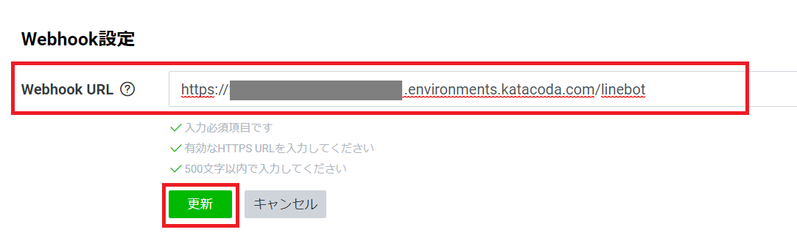
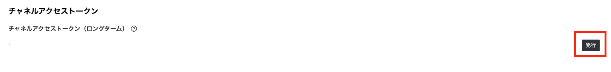

# 1. チャネルの作成

## 1-1. LINE Developers にログイン

[LINE Developers](https://developers.line.biz/ja/) にアクセスしてログイン

## 1-2. プロバイダーを選択

任意のプロバイダーを選択

### プロバイダー未作成の人は画面上の「作成」ボタンを押下して新規作成してください。

- *任意の「プロバイダー名」を入力して作成*
    - *LINE* という文字列は含められません

## 1-3. チャネルを新規作成

### Botのチャネルを作成

### 「Messaging API」 を選択

### チャネル情報を入力

チャネル情報を入力して、「入力内容を確認する」ボタンを押下する。

#### チャネル情報の入力例

|  項目名  |  値  |
| :-- | :-- |
|  アプリ名  |  ハンズオンクイズ  |
|  アプリ説明  |  LDGK LINE Bot ハンズオンで作るクイズBot  |
|  大業種  |  個人  |
|  小業種  |  個人（その他）  |
|  メールアドレス  |  （ご自分のメールアドレス）  |
|  プライバシーポリシーURL  |  （入力不要）  |
|  サービス利用規約URL  |  （入力不要）  |

### 各種規約に同意してチャネルを作成する

### 情報利用に関する事項に同意する

## 1-4. Channel Secret をメモしておく

チャネル基本情報画面に表示されているChannel Secret をメモしておく

## 1-7. Webhook 設定

「Messaging API設定」タブ内にある、Webhook URL の「編集」ボタンを押下してWebhook URL を入力可能状態にする

### Webhook URL に下記のURLを入力する

**要：画像！！！！！**

- `https://[[HOST_SUBDOMAIN]]-8080-[[KATACODA_HOST]].environments.katacoda.com/linebot`{{copy}}

## 1-9. 応答設定

LINE公式アカウント機能 の画面右側にある「編集」リンクを押下して、公式アカウントマネージャー画面を開く

### 応答設定画面を開く

公式アカウントマネージャー画面左の「応答設定」を選択して応答設定画面を開く

応答設定を下記のように設定する

|  項目名  |  値  |
| :-- | :-- |
|  応答モード  |  Bot  |
|  あいさつメッセージ  |  オン  |
|  応答メッセージ  |  オフ  |
|  Webhook  |  オン  |

## 1-6. チャネルアクセストークン を発行してメモしておく

チャネルアクセストークンの「発行」ボタンを押下して発行し、メモしておく

## 1-10. 作成したBotのチャネルを友だち登録する

LINE Bot へのQR コードをLINEアプリで読み込んで友だち登録する

*LINE Bot へのQR コードは、LINE Developers の「Messaging API 設定」タブ内上部にあります*

